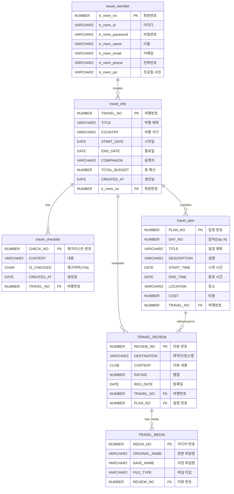

# TRAVEL
> 여행 계획 관리 애플리케이션

## 프로젝트 개요 (Project Overview)
Travel은 여행 계획 관리 애플리케이션으로 사용자의 여행 계획을 보다 편리하게 관리할 수 있는 시스템입니다. 

## 주요 기능 (Key Feature)
- **여행 계획 관리**: 여행 계획을 생성하여 관리할 수 있습니다.

## 기술 스택 (Tech Stack)
- **Backend**: Java 25, JSP
- **FrontEnd**: JavaScript(ES6), CSS3
- **DataBase**: Oracle 21c
- **형상 관리**: Git

## ERD

