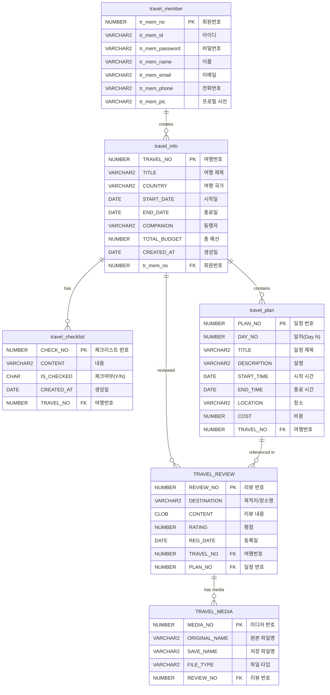
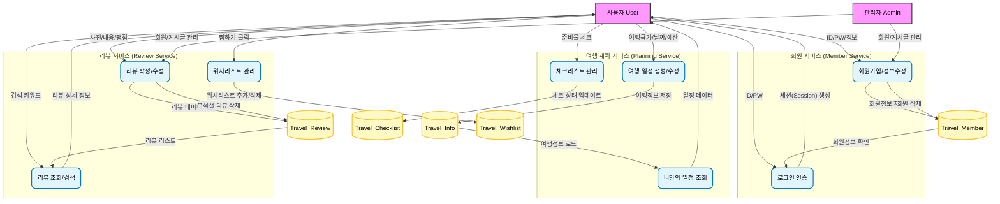

# TRAVEL
> **JSP Model 1 기반의 여행 일정 관리 플랫폼**

## 프로젝트 개요 (Project Overview)
- **개발 기간**: 2025/09/29 ~ 2025/11/27
- **팀 구성**: 3인
- **목표**: 웹 개발의 기초적인 CRUD와 세션 관리, 데이터베이스 연동을 학습하기 위해 진행한 팀 프로젝트

## 주요 기능 (Key Feature)
### 회원 서비스
- **회원 가입**: jQuery를 활용한 아이디 실치간 중복 체크와 정규식검사를 통한 회원가입(My Part)
- **로그인**: session객체를 사용한 사용자 인증 및 권한 분기
- **회원 정보 수정**: cos.jar를 활용하여 프로필 사진 업로드 및 개인 정보 수정(My Part)

### 여행 계획 서비스
- **계획 생성**: 여행 국가, 기간, 동행자, 예산을 설정하고 날짜별 세부 동선 계획
- **리뷰 작성**: 다중 이미지 업로드 및 별점 시스템  
-----
## 기술 스택 (Tech Stack)
- **Backend**: Java 25, JSP Model1
- **FrontEnd**: HTML5, JavaScript(ES6), CSS3
- **DataBase**: Oracle 21c
- **형상 관리**: Git

## ERD

## Data Flow

-----
## Review
- **Good**: 클라이언트와 서버간 데이터 흘므을 직접 구현하여 웹 애플리케이션 동작 원리를 내재화
- **BAD**
- JSP 내 로직 혼재로 유지보수의 어려움 및 비밀번호 평문 저장 등 보안 측면의 한계
- git에 대한 전반적인 이해부족으로 push/pull과정에서 잦은 오류 발생
- **TroubleShooting**: 초기 JSTL을 활용한 DB연결로 변수가 쿼리에 그대로 노출, PreparedStatement방식으로 DB연결 수단을 변경하여 보안 이슈차단

